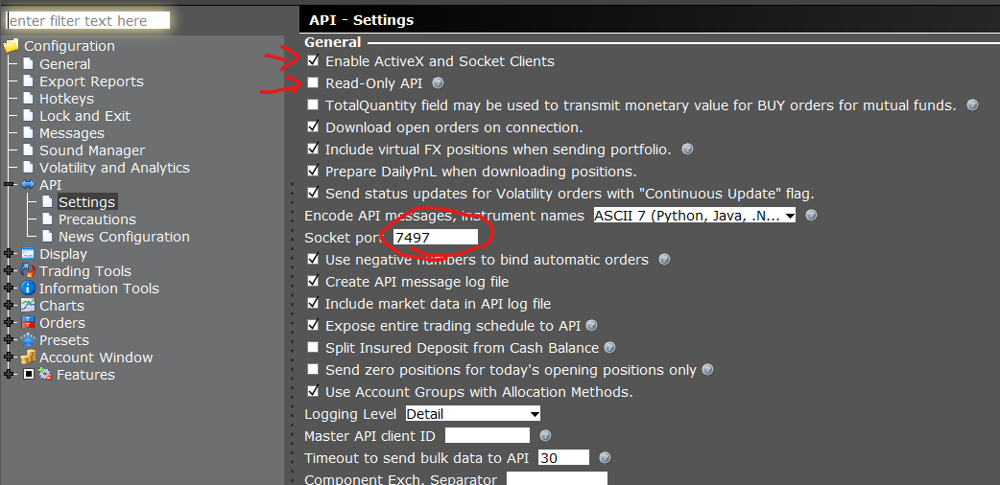

# HT-IBKR-Integrations

Basic Code Structures for interaction with Interactive Brokers TWS (Trader Work Station) or IB_Gateway to connect, get account information, portfolio data, stock prices, historical data, screeners and placing trades (buy and sell orders)

## Installation (Windows)

Download an install this repo

```bash
git clone https://github.com/HobbyTrader/HT-IBKR-Integrations.git
cd HT-IBKR-Integrations
py -m venv env
env\scripts\activate
py -m pip install -U pip
pip install -r requirements.txt

```

## Interactive Broker's API

The python application will use a special package called [ib_async](https://github.com/ib-api-reloaded/ib_async) to connect to the interactive broker's API. The APIs are exposed through a local desktop application called Trader Workstation (TWS) that run on a JAVA.

Get the latest version of [Trader's Workstation](https://www.interactivebrokers.com/en/trading/tws.php) API Access. You will need to create and fund an account to use the API for Paper Trading.  

Interactive Broker'S TWS API [official documentation](https://www.interactivebrokers.com/campus/ibkr-api-page/twsapi-doc/#requests-limitations).
***We are using ib_async NOT IBKR's python package, but it is usefull to read through the available features***  

## Configuration  

See the [ib_async github repo](https://github.com/ib-api-reloaded/ib_async) to view a detailed installation and configuration process and [ib_async documentation](https://ib-api-reloaded.github.io/ib_async/).

But in simple terms you must go to files-> Global Confgiuration -> API -> Settings and check the following parameters:


## Running the samples

The Traderworkstation must be running for the samples to work (it can be in live trading or paper trading)
> **WARNING**  
> Samples will place trades so make sure you use PAPER TRADING while testing and developping
>
> **NOTES**
> With a funded account some Market Data Subscriptions will be offered free of monthly fees. But real time price data will only be available in the live trading account. Paper Trading account will return 15 minute delayed prices.

| Sample | Description | Result |
| --- | --- | --- |
| 01_connect.py | This script connects to the API. It waits until ENTER is pressed, and simply disconnects.<br><br>This acts a simple configurataion test.| Connected to Trader Work Station or ib_gateway. |
| 02_managed_accounts.py | This script will connect to the API and retrieve your managed accounts.<br><br>The terminal console should display your existing bying power (example for a single account in IBKR)| Account: AA99999999 |
| 03_account_summary.py | This script will connect to the API and retrieve your account details.<br><br>The terminal console should display your existing bying power. |  |
| 04_historical_prices_1day.py | This script will connect to the API and retrieve 1 day of historical minute price data, convert it to a PANDAS dataframe, display the last 5 minutes and save to a CSV file in the DATA folder | <br><br> |
| 05_historical_prices_1year.py | A simple script that loops through 1 full year by 5 day decrements to get minute price data for an entire year. | Print of the week being extracted, saved prices in the DATA folder with only the ticker symbol as filename|

## References  

Learning is a long path and great people offer their help through excellent videos.  
Please visite them for more information

***ib_async and Trader Work Station Explanantions***

| Teacher | Link |
| --- | --- |
| Part-Time-Larry | [Interactive Brokers API with Python and ib_async](https://www.youtube.com/watch?v=EYDLlnmM5x8&t=1s) |
| Part-Time-Larry | [Open Range Breakout Strategy in Python with IBKR API and ib_async](https://www.youtube.com/watch?v=a1813iCcsWQ&t=32s) |
| Part-Time-Larry | [Real-Time Market Scanners Example](https://www.youtube.com/watch?v=S9vxHNv_b8E&t=714s) |

---  

## Run Unit Tests commands

### Run single unit test file

```bash
python -m unitttest tests.dto.test_strategy_dto -v
```

### Run all unit tests for dto

```bash
python -m unittest discover tests/dto -v
```

### Run all unit tests under tests folder and sub folders

```bash
python -m unittest discover tests -v
```

---

## Compile project to make package for installation

### 1 - Install package for building

*python -m pip install setuptools*
*python -m pip install build*

Current installed package in python environment

|Package|Version|Package|Version|
|---|---|---|---|
|aeventkit|2.1.0|appnope|0.1.4|
|asttokens|3.0.0|beautifulsoup4|4.14.2|
|build|1.4.0|certifi|2025.10.5|
|charset-normalizer|3.4.4|comm|0.2.3|
|debugpy|1.8.17|decorator|5.2.1|
|executing|2.2.1|google|3.0.0|
|ib_async|2.0.1|ibapi|10.37.2|
|idna|3.11|ipykernel|7.0.1|
|ipython|9.6.0|ipython_pygments_lexers|1.1.1|
|jedi|0.19.2|jupyter_client|8.6.3|
|jupyter_core|5.9.1|matplotlib-inline|0.2.1|
|nest-asyncio|1.6.0|numpy|2.3.4|
|packaging|25.0|pandas|2.3.3|
|parso|0.8.5|pexpect|4.9.0|
|pip|25.3|platformdirs|4.5.0|
|prompt_toolkit|3.0.52|protobuf|6.33.0|
|psutil|7.1.2|ptyprocess|0.7.0|
|pure_eval|0.2.3|Pygments|2.19.2|
|pyproject_hooks|1.2.0|python-dateutil|2.9.0.post0|
|pytz|2025.2|pyzmq|27.1.0|
|requests|2.32.5|schedule|1.2.2|
|setuptools|80.9.0|six|1.17.0|
|soupsieve|2.8|stack-data|0.6.3|
|tornado|6.5.2|traitlets|5.14.3|
|typing_extensions|4.15.0|tzdata|2025.2|
|urllib3|2.5.0|wcwidth|0.2.14|
|xmltodict|1.0.2|||

In order to install the latest version of IBAPI, you've to download the latest pakage from here: <https://interactivebrokers.github.io/#>
Once downloaded

- extract the scripts from the download
- move to the folder: IBJts/source/python client
- execute: python setup.py bdist_wheel
- install the wheel package: python -m pip install --user --upgrade dist/ibapi-10.37.2-py3-none-any.whl
- check the installed version of ibapi with: pip show ibapi

### 2 - Run build command

```bash
python -m build
```

packages are created in dist/ folder
package name and version are taken from information present into pyproject.toml file

```toml
[project]
name = "ht-ibkr-integrations"<br>
version = "0.2.0"
```

---

## Install package

```bash
python -m pip install dist/ht_ibkr_integrations-0.2.0-py3-none-any.whl
```

or

```bash
*python -m pip install ht_ibkr_integrations-0.2.0.tar.gz
```
